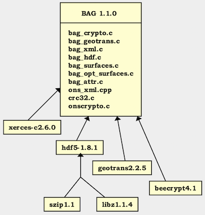
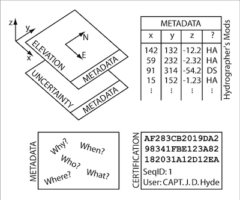
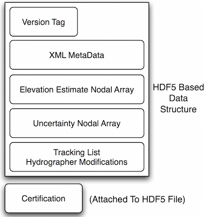
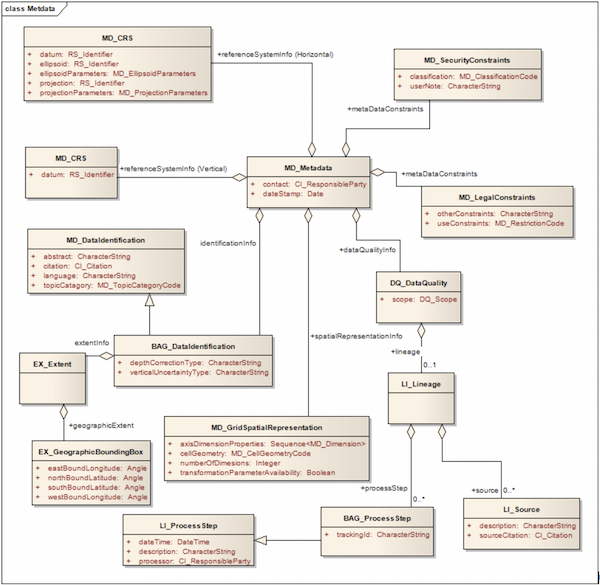
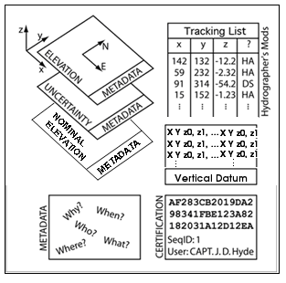
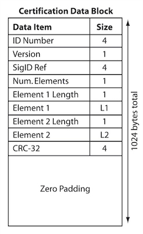

# Overview of the BAG Structure

## Top-Level Requirements

Several top-level requirements were identified during the inaugural ONSWG meeting early in 2004. These requirements provided the foundation on which many of the architectural decisions have been made.  In particular, the ONSWG adopted the following high level requirements:

1.    A freely-distributable source code library shall be available for the BAG.
2.    BAG shall adhere to a defined format, expressed via the source code library and accompanying documentation.
3.    The ONSWG shall provide and oversee a change process to allow for incorporation of bug fixes to the library and extensions to the format.
4.    The BAG library and file format shall be operating system independent, and supported on at least the Win32, and Linux operating systems.
5.    The BAG library and file format shall support files larger than 2 gigabytes.
6.    The BAG file format shall include mandatory data elements, and optional extensions.
7.    The BAG mandatory elements include: metadata, elevation grid, vertical uncertainty grid, change tracking list, and digital signature.
8.    The BAG file format and access library shall maintain all mandatory data elements within a single, self-contained, file structure.
9.    The BAG digital signature shall provide a mechanism to describe intended use of the dataset.
10.    The BAG digital signature shall provide a mechanism to validate that the contents of the file have not changed since original signature.
11.    Extensions to the BAG file format shall be fully defined and approved by the ONSWG prior to adoption.  
12.    The ONSWG shall maintain a web site that describes the status of the project and allows for releases of the library to be downloaded.
13.    The ONSWG shall maintain a revision control system to manage configuration baselines of the BAG library software and documentation.

## Technology Base

As part of the BAG design process, members of the ONSWG reviewed several alternatives for the core technology base for data encapsulation, file I/O, metadata encapsulation, and cryptography.  The group’s basic concept was to adapt existing software technologies where appropriate, with obvious rational based on time and cost to develop.  After some review, the group agreed to adopt Hierarchical Data Format version 5 (HDF-5) to provide the basic mechanisms of data encapsulation, and file I/O [10].  The group also agreed to adopt XERCES  [11] as the preferred XML parser.  Beecrypt was adopted to satisfy BAG’s cryptography needs [12].  Geotrans [13] was adopted to provide cartographic coordinate system transformations.  Fig. 1 provides a graphic overview of the external libraries on which the BAG library depends, showing the version currently used for each dependant (external) library.

**Figure 1: Hierarchy of BAG external library dependencies.**

## BAG File Layout

Fig. 2 provides a conceptual view of the contents of each of the mandatory data elements of a BAG.  The elevation grid contains the two-dimensional array of bathymetry data. The uncertainty grid is co-located with the elevation grid and contains a two-dimensional array describing the vertical uncertainty of the elevation grid.  The tracking list details hydrographer modifications, and the certification section specifies authenticity and intended use of data.

**Figure 2: Mandatory elements of a BAG.**

Fig. 3 shows the structural layout of the mandatory elements of the BAG.  The version tag is a simple text string that specifies the version of the format at the time the BAG was created.  The metadata, elevation, uncertainty, and change-list, are each HDF-5 datasets with a dataset substructure appropriate for the information being stored.  The signature section is simply a byte stream appended after the end of the HDF-5 file using standard C file access mechanisms.    The rationale for adding the signature byte stream after the end of the HDF-5 file is to ensure that the contents of the signature do not modify the file that it is trying to protect.

**Figure 3: BAG file structure.**

For BAGv1.1.0, optional datasets were added and are shown in Error! Reference source not found., for the addition of optional surface layers as defined in the BAG_SURFACE_PARAMS structure.  These optional surface layers are each HDF-5 datasets defined at the root level of the BAG and follow the same substructure as the elevation and uncertainty datasets.  Further extensions for auxiliary information on depth reconstructions and variable resolution layers (from release 1.6.0) have also been defined.

From version 1.1.0, a BAG has a single fixed node-spacing (referred to as grid resolution), and represents a contiguous region of the surface of the earth.  A future version of BAG may allow for storage of multiple grids .  For all practical purposes, grid size is constrained only by available disk space.  Row and column values are dimensioned as unsigned 32 bit integers, and HDF-5 places no fixed upper limit on row or column dimension or on file size.  

Section 4, Axiomatic Definitions, details the coordinate system and standard units of measure used by the BAG library.  Every effort has been made to ensure that the numeric values passed through the BAG library function interfaces all adhere to the definitions detailed in Section 4.

In version 1.6.0, a series of optional layers were added to support variable resolution grids.  These are described, along with the API changes, in the 2016-05-24_VariableResolution.docx document; this document should be available from the same place as the core BAG FSD.

## Metadata
### Requirements for Metadata

With the evolution of digital data, also comes the necessity to accurately track and attribute this data.  BAG is no exception.  One of the primary goals behind the BAG initiative was to provide a way to uniformly encode, decode and exchange the information about who, what, when, where, and how the BAG file was created.

### Standard Object Model

During the first meeting of the Open Navigation Surface Working Group in January 2004, it was concluded that the ISO metadata standards 19915 and 19115-2 would be used as the common framework to store the metadata information needed by the BAG format.  A sub-working group was selected and assigned to work on creating the appropriate metadata profile to describe the BAG file contents.  The profile was created and is depicted in Fig. 4.  This profile describes the minimum required fields for a valid BAG file.  However, the user is not limited to this profile, and may include any of the other components described in the 19115 standard.

**Figure 4: UML model for BAG metadata profile.**

The ISO 19115 object model provided most of the needed classes and attributes required to fully describe the BAG content.  There were three extensions made to the model to allow for detailed description of the data.  First, the verticalUncertaintyType attribute was added to allow the BAG file to accurately describe the source and meaning of the encoded Uncertainty grid layer. Table 1 shows the list of supported values as of the 1.1 release.

| Enumerated Value | Description |
| :-------------------- | :------------ |
| Unknown | "Unknown" - The uncertainty layer is an unknown type |
| Raw_Std_Dev | "Raw Standard Deviation" - Raw standard deviation of soundings that contributed to the node |
| CUBE_Std_Dev | "CUBE Standard Deviation " - Standard deviation of soundings captured by a CUBE hypothesis (i.e., CUBE’s standard output of uncertainty) |
| Product_Uncert | "Product Uncertainty" - NOAA standard product uncertainty V1.0 (a blend of CUBE uncertainty and other measures).|
| Historical_Std_Dev | "Historical Standard Deviation " – Estimated standard deviation based on historical/archive data.|

**Table 1: Table of uncertainty types.**

 Secondly, the trackingId extension allows internal Tracking List entries to be associated with a unique entry in the metadata so that the changes can be properly attributed, described and easily referenced.
 
Thirdly, the depthCorrectionType extension was added to allow the BAG file to accurately describe the correction performed on the data.  Table 2 shows the list of supported values as of the 1.1 release.

| Enumerated Value | Description |
| :-------------------- | :------------ |
| True_Depth | “True Depth” – Depth corrected for sound velocity |
| Nominal_Depth_Meters | “Nominal at 1500m/s”- Depth at assumed sound velocity of 1500m/s |
| Nominal_Depth_Feet | “Nominal at 4800ft/s” – Depth at assumed sound velocity of 4800ft/s |
| Corrected_Carters | “Corrected via Carter’s Tables” – Corrected depth using Carter’s tables |
| Corrected_Matthews | “Corrected via Matthew’s Tables” – Corrected depth using Matthew’s tables |
| Unknown | “Unknown” – Unknown depth correction type or mixture of above types |

**Table 2: Table of depth correction types.**

### Common Encoding

After choosing the ISO standard object model for metadata encapsulation, a format was needed to store this structure.  The ISO had already begun work on the 19139 specification for storing the 19115 structure into XML format.  It was decided that XML seemed to be a logical medium as it was both machine and human readable, and is already a well known storage format for many other standards.

To keep the library API flexible, the metadata is provided to the library as a character stream.  The stream is validated and stored in its own HDF-5 block at the end of the file before the digital signature.  This data block in the HDF-5 file is configured as an extendable block to allow the metadata to grow in the future and not disturb the remaining data blocks.  In a similar fashion, the metadata can be extracted from the file in its native XML character stream and thus can be processed by any regular XML tools.

### Internal Parsing and Validation

Each time a metadata stream is processed by the library (for read, creation, or update) it must be validated to ensure that it is well-formed XML and, more importantly, meets the requirements of the defined BAG profile.  In order to perform this validation, the library requires an internal XML parser.  Given that the 19139 XML schema is quite complex, the libXML2 parser is used to read the XML stream, associated schema files, and perform all validation.  This validation occurs transparently to the user during the open or creation API routines.

## Elevation Grid

The elevation section of the BAG contains a two-dimensional matrix of elevation values, organized in row major order, and starting from the south-western most data point, where each value is defined to be the elevation at an exactly specified geographic point (node).

An important distinction to note is the contrast between this node-based approach where each grid value describes the elevation exactly at a specified geographic point, as compared with a cell oriented approach, where each grid value might describe the elevation as applying over the extents of the cell size.  The elevation data in a BAG describe the elevation only at the exact node locations, and offer no information about the elevation between the nodes.

The units of the elevation values are meters, and the sign convention is for z to be positive for values above the vertical datum.  The reference vertical datum for the BAG is one of the mandatory Metadata items.  This sign convention follows directly from the right hand coordinate system definition that BAG adheres to.  See section 4, for additional information.  The elevation values are encoded as four byte floats within an HDF-5 dataset.  The x and y location of each elevation value is not explicitly saved within the dataset.

Rather, the x, y location of the south-western most node is saved within the metadata section, along with the x node spacing and the y node spacing.  Fixed, regular spacing between nodes is required.  The unknown state for elevation is defined to be 1,000,000.0 (1.0e6).

## Uncertainty Grid

The uncertainty section of the BAG contains a two-dimensional matrix of values that specify the vertical uncertainty at each node.  The elevation grid and the uncertainty grid are explicitly co-aligned.  The values are expressed as positive quantities in units of meters.

As detailed in Table 1, the uncertainty grid supports multiple definitions of vertical uncertainty.  This allows BAGs to span the expected range of data products from raw, full resolution grid to final compiled product.  For example, a BAG at the stage of final survey data processing should contain uncertainty information germane to the survey data itself and intended to be used for information compilation.  A BAG intended for navigational purposes would need to specify the overall uncertainty to the mariner – these two values for uncertainty may be quite different.

A recipient of a BAG file can refer to the uncertainty definition in the Metadata to gain an understanding of how the uncertainty was computed.  The uncertainty values are encoded as four byte floats within an HDF-5 dataset.  The unknown state for uncertainty is defined to be 0.0.

## Tracking List

The tracking list contains a simple list of the original elevation and uncertainty values from any node of the surface that has been modified to account for hydrographer over-rides of the basic surface definition (e.g., as originally computed by an algorithmic method).  The tracking list dataset and corresponding information contained in the metadata exist to provide an audit trail record of changes made to the data by manual intervention.  The contents of the tracking list dataset are shown in Fig. 5.

| Field | Size |
| :----- | :---- |
| row | 4 |
| col | 4 |
| depth | 8 |
| uncertainty | 8 |
| track_code | 1 |
| list_series | 2 |

**Figure 5: Tracking list item - size in bytes**

The row and col fields describe the node that has been modified.  The depth and uncertainty fields contain the original values prior to manual intervention.  The track_code field provides a reason code for the manual modification of a grid surface node. 

The list_series field of the tracking list item structure is used to identify an entire series of tracking list items and associate them with supplemental details in the BAG Metadata.  There should be corresponding Metadata entries for each suite of list_series’ tracking list items.  One can then gather from the Metadata the circumstances and motivation behind a particular group of edits to the BAG depth and uncertainty surfaces.

## Extensions

Extensions are optional and not required for a HDF file to be qualified as a BAG. Vendors or other third parties can apply for extensions to the format by the method outlined in this requirements document (please refer to section 8).

### Nominal Elevation

Note Fig. 6 shows an extension made to the BAG API starting with version 1.5.1, regarding the addition of optional datasets.  As listed in the BAG_SURFACE_PARAMS, Nominal Elevation is one of the optional layers that can be included in the BAG.

**Figure 6: Example of BAG with optional dataset of nominal elevation.**

“Nominal Elevation” is the term used by some hydrographic organisations to refer to an elevation value that is corrected for sound speed such that an echosounder (typically a single-beam system) that uses a fixed, assumed, speed of sound will indicate the same depth as that provided in the Nominal Elevation layer.  Often, this is used where the echosounder cannot have a speed of sound profile applied, or where obtaining such a profile would be impossible, or prohibitively expensive.  The speed of sound used for “nominal” should be documented in the metadata.

### Vertical Surface Correctors

This optional dataset may comprise a regularly-spaced grid topography or a set of irregularly spaced coordinates. The intended approach is that the BAG creator provides sufficient data density to allow a simplistic inverse distance interpolation scheme to generate correction values at the full resolution of the BAG elevation nodes.   The library includes an API function to perform this computation based on the surface correctors dataset and the desired BAG surface for either type of topography (regular or irregular spacing).

### Elevation Solution Group

The elevation solution group is designed to contain the shoal elevation, standard deviation, and number of soundings associated with a node in the grid.  The shoal elevation is the elevation value of the least-depth measurement selected from the sub-set of measurements that contributed to the elevation solution.  The number of soundings is the number of elevation measurements selected from the sub-set of measurements that contributed to the elevation solution. The stddev is the standard deviation computed from all elevation values that contributed to the node. Note that the stddev value is computed from all measurements contributing to the node, whereas shoal elevation and number of soundings relate to the chosen elevation solution. 

### Node Group

 The node group has two components: hypothesis strength and number of hypotheses.  The hypothesis strength and number of hypotheses are computed in the CUBE/CHRT algorithm.  
 
## Certification

> Note: Due to the large-scale changes to the BAG codebase as part of moving from C to C++14, support
> for BAG Digital Signatures has been removed from the 2.0.0 codebase. Signing support will be added back
> to a subsequent release of the BAG library.

### Intent of the BAG Digital Signature Scheme

In a traditional hydrographic processing workflow, there is a strict chain of custody for all data that is to be used for nautical charting.  At each stage of the chain, a responsible authority reviews the data, the processes applied to it, and certifies that the data is fit for some intended purpose.  This may be that the data is ready for final plotting, that it is ready to be combined with other data in a compilation, or that the compilation is suitable as an aid to safe surface navigation.  Generally, this is done by some physical signature on appropriate archival documentation, which is traditionally the hydrographic smooth sheet or fair sheet.

With an all-digital product, however, there is no opportunity to affix a physical signature to the data object.  In addition, with a dense data object such as a BAG, the opportunity for single-bit errors in transmission to cause navigationally significant changes to the data which are otherwise undetectable is greatly increased.  The Digital Signature Scheme (DSS) for the BAG is designed to provide an equivalent analogue for the physical hydrographer’s signature, and to ensure that any modifications to the data, either by mistake or malicious action, are readily detectable.

This section describes the implementation for the DSS interaction with the BAG file format in outline.  Full details of the process are available in the whitepaper, “Digital Signature Scheme for the Bathymetric Attributed Grid (BAG)” [6], which is available from the project’s website.

### DSS Implementation

The basic entity of the DSS is the Digital Signature (DS), a multi-byte sequence of digits computed from the contents of the BAG file excluding the certification information and another number, known as the secret key (SK), belonging to the person or entity signing the BAG, known as the Signature Authority (SA).  The SK is known only to the SA, and as the name suggests should be kept confidential since knowledge of the SK would allow anyone to certify BAGs as if they were the SA.  The DS value can be shown to be probabilistically unique for the contents of the BAG and the SK in the sense that, with vanishingly small probability, no two BAGs would generate the same DS with a particular SK, and no two SKs would generate the same DS with the same BAG.

Corresponding to the SK, there is a public key (PK) that can be distributed freely.  There is no way to compute the DS using the PK.  However, given a BAG and a DS purported to have been constructed with the SK, it is simple to verify whether the BAG has changed, or if another SK was used to construct the certification.

In addition to the basic DS required for the DSS, the BAG certification block contains a 32-bit integer used to link the certification event with an entry in the metadata’s lineage section which describes the reasons for certification.  The intent of this is to ensure that the user can provide suitably flexible descriptions of any conditions attached to the certification event, or the intended use of the data so certified.  This ‘Signature ID’ shall be a file-unique sequentially constructed integer so that a certification block can be unambiguously associated with exactly one lineage element.

The DSS is not mandatory, in the sense that the API does not enforce checks for certification blocks or DS results as BAG files are opened, written or closed.  A BAG without a certification block shall be considered valid.  The BAG API provides means to construct and verify DS values, but does not address questions of key distribution, certificate generation or certificate signing.  Users are urged to consult an appropriate reference (e.g., [7]) for details of these processes.

### Stucture of the BAG Certification Block

The BAG DS information shall be maintained in a certification block of length 1024 bytes, appended to the end of the HDF-5 data.  The structure of the certification block shall be as shown in Fig. 7.  The ID number shall be a ‘magic number’ to identify the block, and the version byte shall be used to identify the structure of the remainder of the block between different versions of the algorithm.  The SigID number corresponds to the Signature ID described above, and shall be followed immediately by the DS values which shall be stored sequentially as a length byte followed by the digits of the element.  The CRC-32 checksum shall be used to ensure that any accidental or intentional corruption of the certification block will be detectable.  The block shall be stored in little endian format, and zero padded to the full size of the block.

**Figure 7: Structure of the BAG Digital Signature Scheme certification block.**

## [Next: Encapsulation](FSD-Encapsulation.md)