# The BAG API

## Structure of the Source Tree

The source code for the BAG access library can be obtained as described in Section 7.  The basic structure is outlined in Table 9.  The BAG Application Programming Interface (API) is defined in the ``api`` sub-directory, with the primary interface defined in ``bag.h``. User-level code should not use any of the deeper interface functions (i.e. those not declared for public consumption in ``bag.h``) since they do not present a uniform reporting structure for errors and return codes.  Special instructions for compilation and the structure of the library are in a ``readme.txt`` file in the top level directory. Other ``readme.txt`` files provide detailed information throughout the remainder of the source tree.  Full details of the API structure are given in the ``docs/api`` sub-directory, constructed with ``doxygen`` [9] directly from the source code.

| Directory |       | Description |
| :---------- | :--- | :------------ |
| **api** | | BAG API files.|
| **configdata** | | Configuration binary files, transformation and other geodetic data. |
| | ISO19139 | Meta-data schemas and definitions. |
| **docs** | | Documentation of the BAG file structure. |
| | api | ``doxygen`` documentation of API in HTML form. |
| **examples** | | Example source files showing how to exercise the API. |
| | bagcreate | Create an example BAG given metadata in XML form. |
| | bagread | Read a BAG and write formatted ASCII output. |
| | excertlib | Sub-library to handle XML DSS certificates. |
| | gencert | Generate an XML certificate pair for the DSS. |
| | sampledata | Small example BAG files for testing. |
| | signcert | Sign an XML public key certificate for the DSS. |
| | signfile | Sign a BAG file using the DSS. |
| | verifycert | Verify the signature on a public key DSS certificate. |
| | verifyfile | Verify the signature of a BAG using the DSS. |
| **extlibs** | | External libraries used by the BAG API. |
| | beecrypt | General cryptographic library used for the DSS. |
| | geotrans | General geographic transformations. |
| | hasp | Hardware encryption token support library. |
| | HDF-5 | Hierarchical Data Format support library, version 5. |
| | HDF-5-linux | Hierarchical Data Format support library, Linux build. |
| | lib | Storage for built external libraries. |
| | libxml | Simple XML parser library for excertlib support. |
| | mkspecs | Configuration files for qmake cross-platform support. |
| | szip | Scientific code ZIP library (for HDF-5). |
| | BAG_XML_lib_1.9 | Provides access to XML metadata. |
| | xercesc | Comprehensive XML parser library for BAG metadata. |
| | zlib | ZIP library (for HDF-5). |

**Table 9: Source tree structure for the BAG API library, version 1.1.**

## Basic Data Access

The BAG API supports a standard open/read-write/close process for dealing with BAG files, using ``bagFileOpen()`` and ``bagFileClose()`` to open/close existing files, and ``bagFileCreate()`` to create new files.  When creating files, the user is responsible for filling out a ``bagData`` structure with the appropriate parameters and data (see ``bag.h`` for definitions) before calling ``bagFileCreate()``; appropriate XML metadata is required to create a BAG file, ``bagInitDefinitionsFromFile()`` can be used, or ``bagInitDefinitionsFromBuffer()`` can be used if the XML has already been read into memory.  A convenience function, ``bagInitDefinitionsFromBag()``, for use with pre-existing BAGs will also initialize the BAG definition from the BAG file’s Metadata dataset.

The information required to access a BAG file is held in the bagHandle structure that is returned from ``bagFileOpen()`` or ``bagFileCreate()``. This must be preserved throughout any process transaction with a BAG file. User level code cannot use ``bagHandle`` directly since it is opaqued in ``bag_private.h``.  However, access functions such as ``bagGetDataPointer()`` can be used to obtain any relevant information from the structure, such as a pointer to the data definition arrays, so that user-level code can access file-global definitions like the number of rows or columns in the data grids.

Once the file is open, data can be read either node by node using ``bagReadNode()`` or ``bagReadNodeLL()`` for projected and geographic grids, respectively (the type of grid can be found from the metadata), by row using ``bagReadRow()``, within a sub-region using ``bagReadRegion()`` or as a full dataset using ``bagReadDataset()``.  The last three functions operate in node space, using row/column indices into the array rather than projected or geographic coordinates.  Equivalently named calls (e.g., ``bagWriteNode()``, ``bagWriteNodeLL()``) are available to write data.  Note that all data in the mandatory elements are single-precision floating point numbers, but the access calls use pointer-to-void formal parameters in order to opaque this restricted data type for future expansion.

The BAG structure is a uniform grid, defined by the geo-referencing point and a grid resolution in east and north directions.  Therefore, no coordinates are required on a per-node basis since they may be computed implicitly from the row/column of the node in question.  To assist in this, calls such as ``bagReadNodePos()``, ``bagReadRowPos()`` or ``bagReadDatasetPos()`` augment the similarly named calls described previously by computing the positions of the rows and columns, which are returned in two linear arrays (one for vertical position of the rows, and one for the horizontal position of the columns) with respect to the grid’s coordinate system.  Note that this is the only recommended way of computing physical coordinates for nodes, and these positions cannot be computed subsequent to the read/write call.

With the addition of the optional dataset layer in Version 1.1 the call ``bagCreateOptionalDataset()``, was implemented to create the optional dataset with a surface type parameter as decsribed in the ``BAG_SURFACE_PARAMS`` structure.  Once the dataset(s) have been created calls to ``bagWriteOptNode()``, ``bagWriteOptRegion()``, and the like have been added to write the data to the datasets.  Read capability can be achieved with calls such as ``bagReadOptNode()``, ``bagReadOptRegion()``, similar to those calls that are used for the reading of the elevation and uncertainty datasets.  To assist in the determination of the contents of the BAG, the call ``bagGetOptDatasets()`` has been added to retrieve the number of optional datasets contained in the BAG and the surface type of those layers as defined in the ``BAG_SURFACE_PARAMS``. 

## Metadata Access

XML metadata is treated as a simple binary stream of bytes.  The XML stream can be read and written with ``bagReadXMLStream()`` and ``bagWriteXMLStream()`` respectively.  When complete, the user code should call ``bagFreeXMLMeta()`` so that any dynamically allocated memory associated with the XML data parser is released to avoid memory leaks.

### BAG XML Metadata Library

The purpose of the BAG XML Metadata library is to provide BAG software developers easy access to the individual components of the BAG metadata.  The BAG XML Metadata library may be used to read and write individual, upper-level metadata components within the BAG XML metadata stream.  The metadata library supplies data structures that correspond to the upper-level metadata components within the metadata XML schema.  The library also supplies methods to “get” and “set” the individual upper-level metadata components as well as a method to create a valid XML instance of all the metadata components as a string. In addition, the library provides utility to methods to initialize data structures and print data structures.  Accompanying the library is an HTML document that provides details of the data structures and the methods provided.  Also accompanying the library are sample applications that illustrate use of the library.

The library does not support all possible scenarios that are valid per the metadata XML schema.  Instead, the library provides support for navigation specific requirements.  The following sections outline the support that is provided by the library.  The mapping of library data structures to XML schema is detailed in Appendix A.

Each of the following sections contains graphics of the metadata XML schema which has been altered to indicate the features supported by the BAG XML Metadata library.  Each uppermost node in the metadata XML schema is detailed in a following section.  Each section has one or more graphics depicting the items that the BAG XML Metadata Library supports.  Within each graphic, the original schema documentation is unaltered.  Documentation that begins with “Nav Spec” has been added to the original schema to indicate support provided by the BAG XML Metadata Library.  Nav Spec is an abbreviation for “Navigation Specific.”  In addition, the number of allowed node occurrences has been altered to indicate the number that the library currently supports. 

#### MD_Metadata

Figure 9 is a graphic depiction of the uppermost XML metadata nodes that the library supports and the number of node occurrences that are supported by the BAG XML Metadata Library.  Note that not all of the upper-level nodes supplied by the metadata schema are supported.  For many of the supported nodes, only one occurrence is supported and that one occurrence is required.

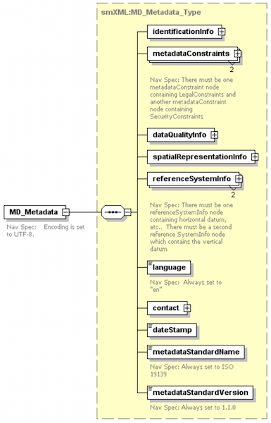

**Figure 9: Uppermost nodes in metadata XML schema.**

#### IdentificationInfo

The metadata XML schema allows for one to an unbounded number of ``identificationInfo`` nodes.  The BAG XML Metadata Library supports only one occurrence of this node, Figure 10.  Note that an XML element named ``depthCorrectionType`` has been added.  Multiple figures below depict the drill down into the ``identificationInfo`` node.

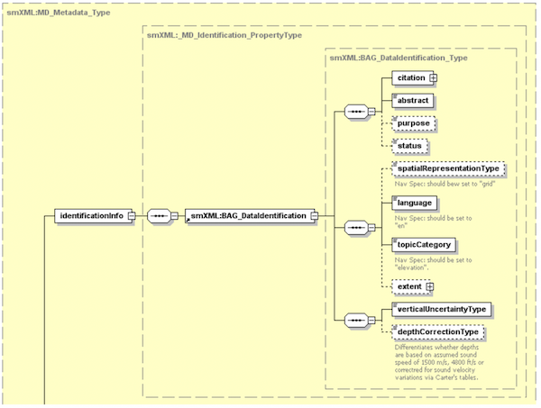

**Figure 10: ``IdentificationInfo`` node.**

The citation node is shown in Figure 11-12.  Note that the library does not support all optional nodes listed in the metadata XML schema.

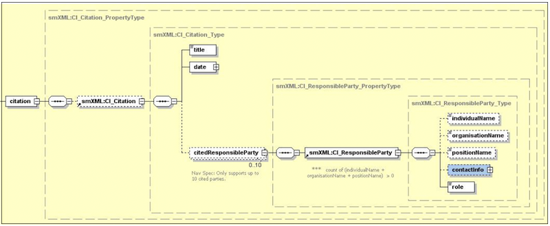

**Figure 11: ``citation`` metadata node.**

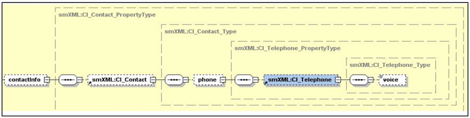

**Figure 12: ``contactInfo`` metadata node.**

The extent node is shown in Figure 13.

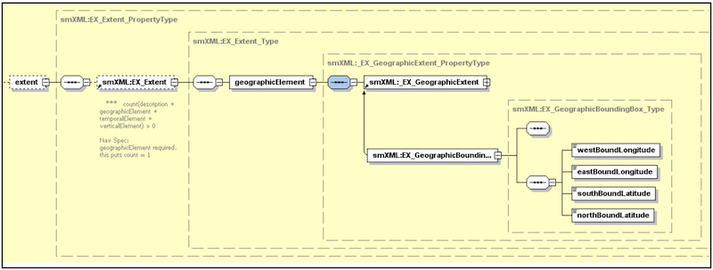

**Figure 13: ``extent`` metadata node.**

Figures 14-15 are the BAG XML Metadata Library structures that represent the above XML nodes.  Mapping from the XML nodes to the library data structures is listed in Appendix A.

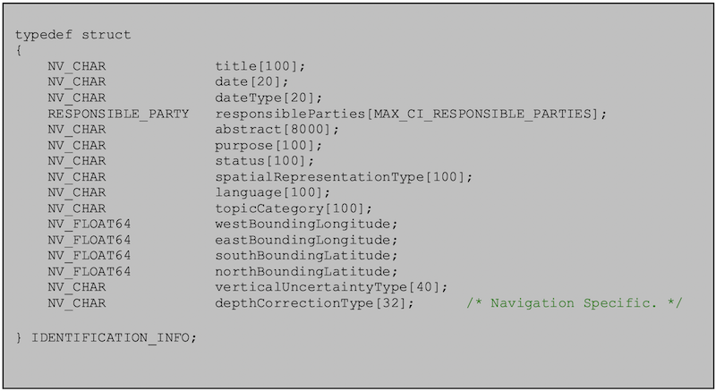

**Figure 14: Library ``IDENTIFICATION_INFO`` data structure.**

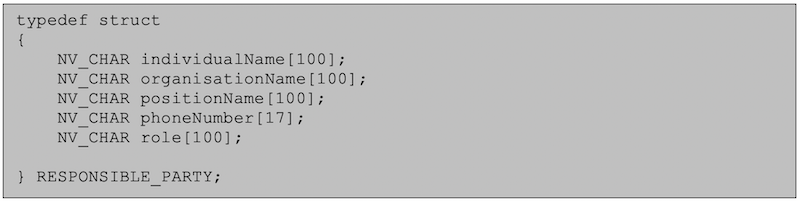

**Figure 15: Library ``RESPONSIBLE_PARTY`` data structure.**

#### MetadataConstraints

The metadata XML schema allows for zero to an unbounded number of metadataConstraint nodes. The BAG XML Metadata Libarary supports two metadataConstraint nodes.  There must be one metadataConstraint node containing LegalConstraints and another metadataConstraint node containing SecurityConstraints.

The metadataConstraints node is shown in Figure 16.

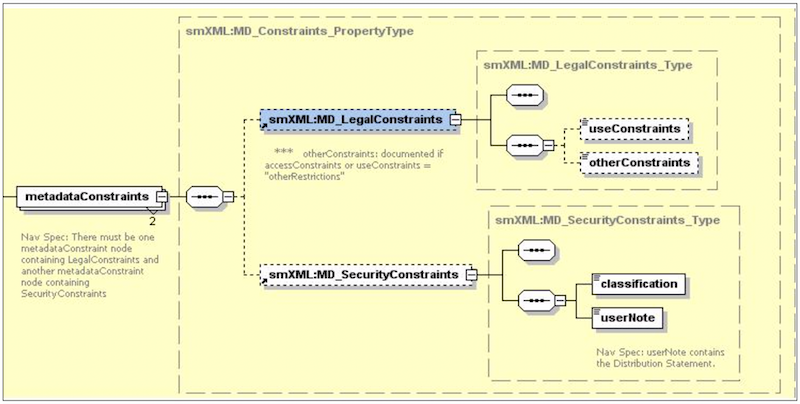

**Figure 16: ``metadataConstraints`` node.**

Figure 17-18 show the library structures that represent the above nodes.

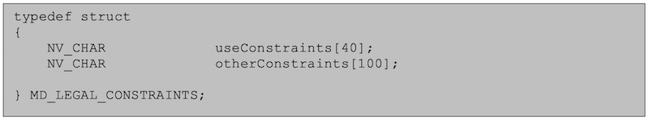

**Figure 17: ``MD_LEGAL_CONSTRAINTS`` library structure.**

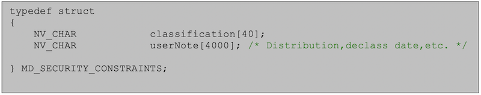

**Figure 18: ``MD_SECURITY_CONSTRAINTS`` library structure.**

#### DataQuality

The metadata XML schema allows for zero to an unbounded number of ``dataQuality`` nodes, FIgure 19.   The BAG XML Metadata Libarary supports only one occurrence of this node.  Figures 20-25 depict the drill down into this node.

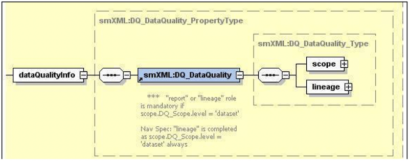

**Figure 19: ``dataQualityInfo`` node.**

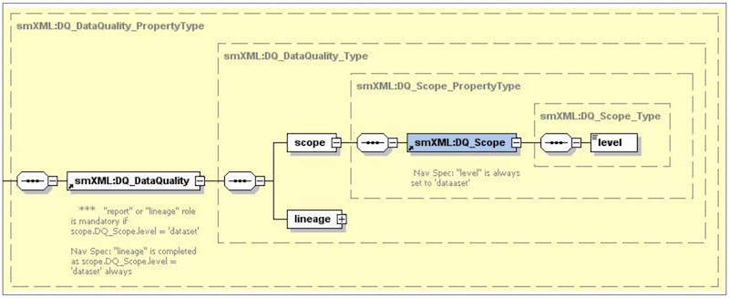

**Figure 20: ``scope`` node.**

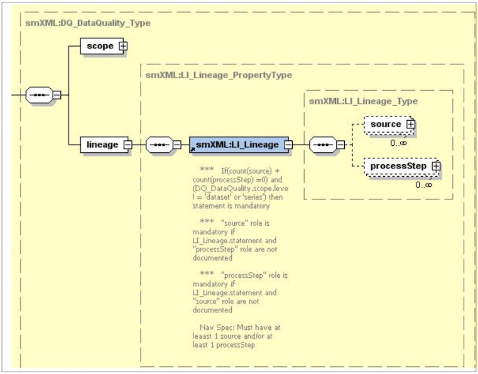

**Figure 21: ``lineage`` node.**

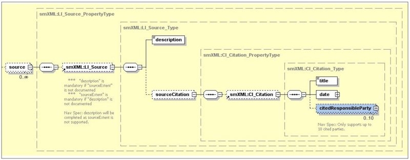

**Figure 22: ``scope`` node.**

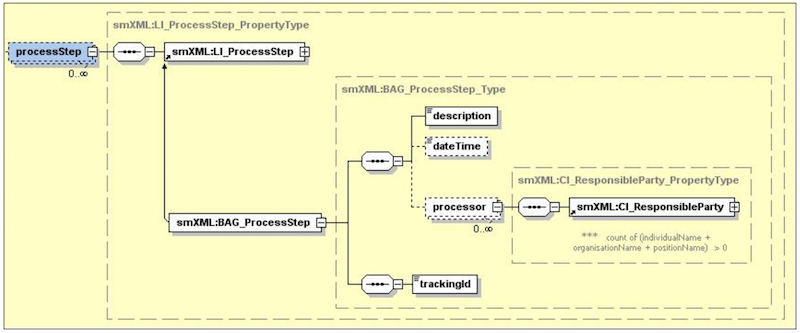

**Figure 23: ``processStep`` node.**

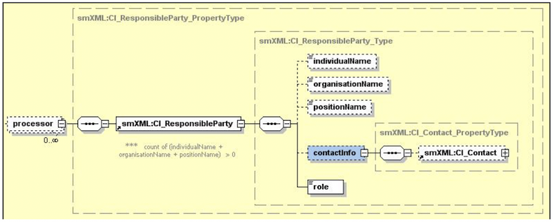

**Figure 24: ``processor`` node.**

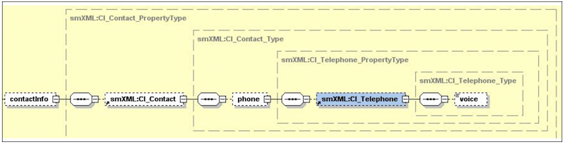

**Figure 25: ``smXML:CI_Contact`` node.**

Figures 26-29 show the library structures that represent the above nodes.  Mapping from the XML nodes the library data structures is listed in Appendix A.

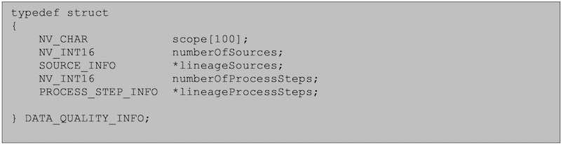

**Figure 26: ``DATA_QUALITY_INFO`` library structure.**

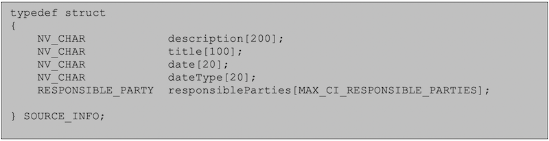

**Figure 27: ``SOURCE_INFO`` library structure.**

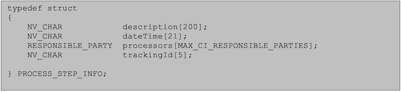

**Figure 28: ``PROCESS_STEP_INFO`` library structure.**

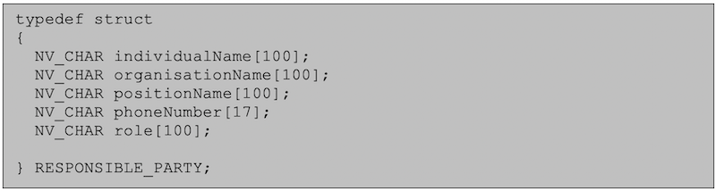

**Figure 29: ``RESPONSIBLE_PARTY`` library structure.**

#### SpatialRepresentationInfo

The metadata XML schema allows for one to an unbounded number of spatialRepresentationInfo nodes.  BAG XML Metadata Library supports having only one occurrence of this node.

Figures 30-33 depict the drill down into this node.  The graphics indicate the elements and number of occurrences supported by the library.  Note that the BAG XML Metadata Library constrains the ``axisDimensionProperties`` so that only three dimensions are supported.  In the resolution node (Figure 32), the ``uom_r`` node is written but no value is assigned.

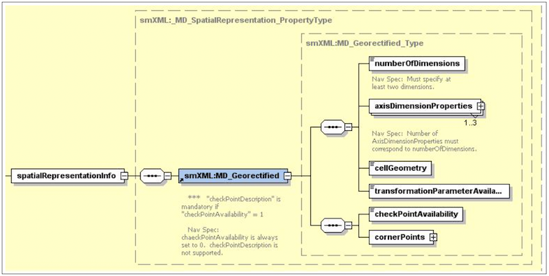

**FIgure 30: ``spatialRepresetnationInfo`` node**

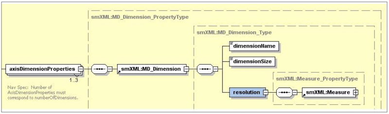

**Figure 31: ``axisDimensionProperties`` node**

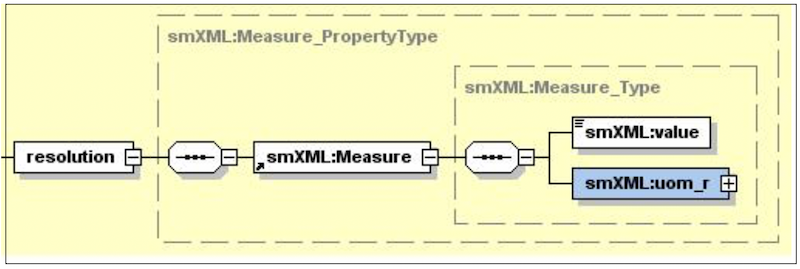

**Figure 32: ``resolution`` node**

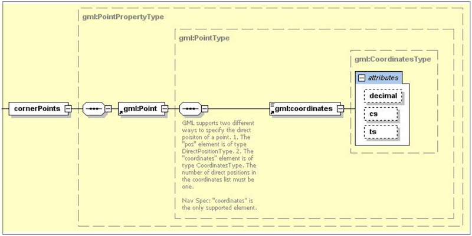

**Figure 33: ``cornerPoints`` node**

Figures 34 is the library structure that represents the XML nodes in Figures 30-33.

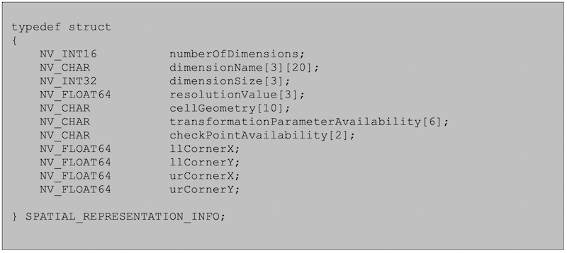

**Figure 34: ``SPATIAL_REPRESENTATION_INFO`` library structure.**

#### ReferenceSystemInfo

The metadata XML schema allows for zero to an unbounded number of ``referenceSystemInfo`` nodes.

BAG XML Metadata Library supports only two occurrences of this node.  The first node contains horizontal datum, etc. The second node contains only the vertical datum information.  Figures 35-38 depict the drill down into the node structure.

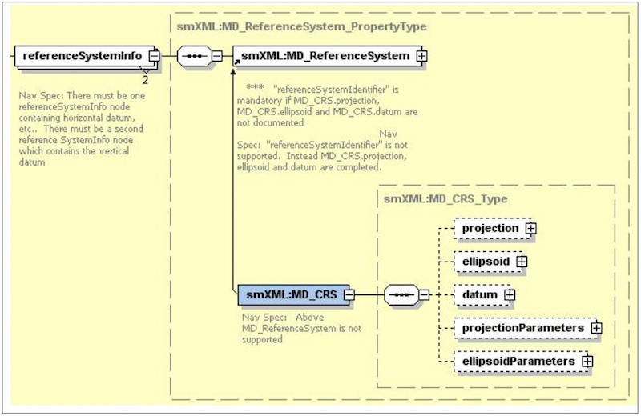

**Figure 35: ``referenceSystemInfo`` node.**

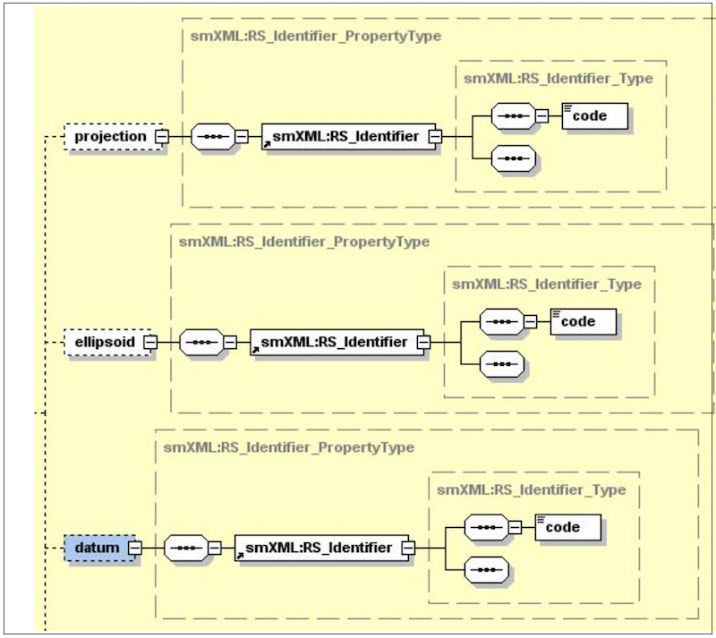

**Figure 36: ``projection``, ``ellipsoid``, and ``horizontalDatum`` nodes.**

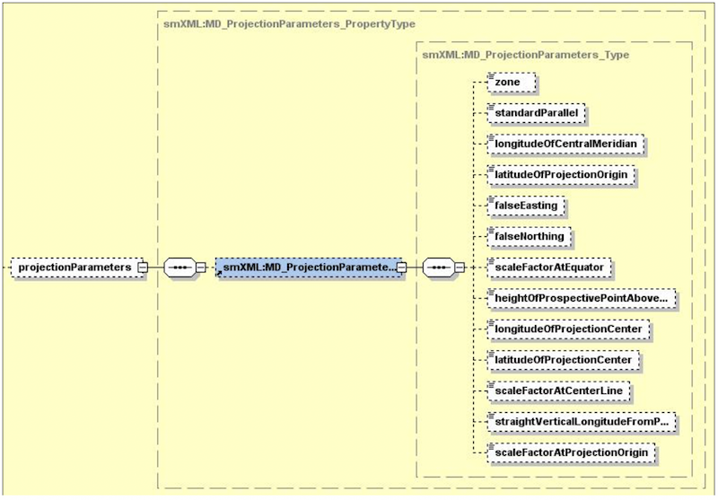

**Figure 37: ``projectionParameters`` node.**

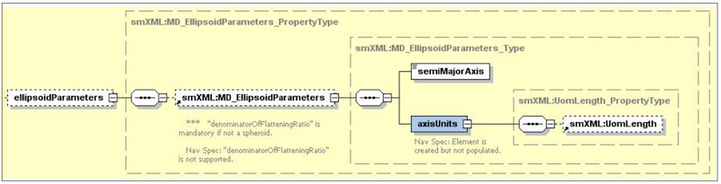

**FIgure 38: ``ellipsoidParameters`` node.**

Following are the library structures that represent the above nodes.  Mapping from the XML nodes to the library data structures is provided in Appendix A.

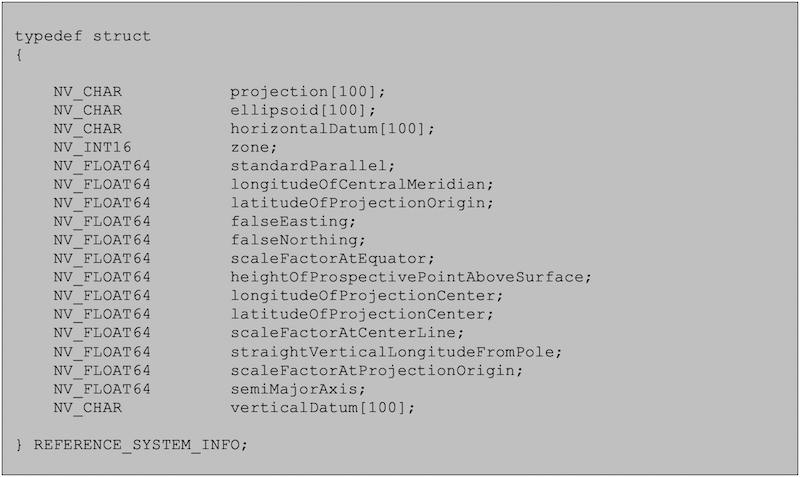

**Figure 39: ``REFERENCE_SYSTEM_INFO`` library structure.**

The group of fields from the field named projection through the field named ``semiMajorAxis`` represent the contents of the first ``referenceSystemInfo`` node.  The field named ``verticalDatum`` represents the contents of the second ``referenceSystemInfo`` node.

#### Language

Optional in the metadata XML schema.  The BAG XML Metadata Library requires this node.  There is no library data structure that represents this metadata.  Developers should use a character pointer to represent this metadata.

#### Contact

The metadata XML schema allows for one to an unbounded number of contact nodes.  The BAG XML Metadata Library supports only one occurrence of the contact node, Figure 40.  The library equivalent is shown in Figure 41.

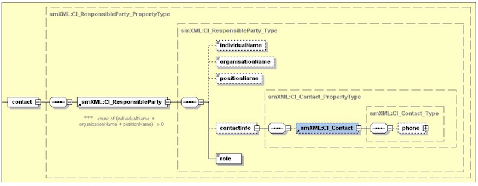

**Figure 40: ``contact`` node.**

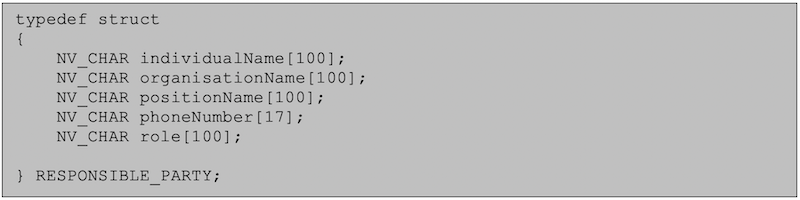

**FIgure 41: ``RESPONSIBLE_PARTY`` library structure.**

#### DateStamp

The BAG XML Metadata Library requires this node.  There is no library data structure that represents this metadata.  A developer must declare a string variable to represent this structure.

#### MetadataStandardName

The ``metadataStandardName`` element is optional in metadata XML schema.  The BAG XML Metadata Library requires this node.  There is no library data structure that represents this metadata and the developer need not create one.  The XML node is automatically populated by the metadata library when an XML string is created.

#### MetadataStandardVersion

The ``metadataStandardVersion`` element is optional in metadata XML schema.   The BAG XML Metadata Library requires this node.  There is no library data structure that represents this metadata and the developer need not create one.  The XML node is automatically populated by the metadata library when an XML string is created.

## Tracking List Access

The tracking list component of the BAG file is accessed via direct calls.  The number of elements in the list can be read with ``bagTrackingListLength()``, and individual nodes in the list may be obtained using ``bagReadTrackingListIndex()`` using linear indexing into the list.  Multiple tracking list items can be read at a time according to a number of different criteria:

``bagReadTrackingListNode()`` returns all of the items associated with a particular grid node, ``bagReadTrackingListCode()`` returns all items which are tagged with a particular reason code, and ``bagReadTrackingListSeries()`` returns all items which are tagged with the same metadata series number (i.e., which were all generated with one metadata lineage entry).  Similarly named routines to write tracking list entries are also included.  If required, the nodes of the tracking list can be sorted according to any of the criteria above using routines such as ``bagSortTrackingListByNode()``, ``bagSortTrackingListBySeries()``, etc.

## Digital Signatures

The Digital Signature Scheme for the BAG file is briefly defined in Section 2.9, and in more detail in the DSS whitepaper [6].  Key pairs are generated with ``bagGenerateKeyPair()``, message digests are computed and signed with ``bagComputeMessageDigest()`` and ``bagSignMessageDigest()`` respectively, and file signatures can be computed directly using ``bagComputeFileSignature()`` if the message digest is not required separately.

Certification blocks are read, written and verified by ``bagReadCertification()``, ``bagWriteCertification()`` and ``bagVerifyCertification()`` respectively.  These routines are capable of silently creating a new certificate block at the end of the BAG if one is not present on write.

As convenience for the user who does not want to get into the details of the DSS, the ``bagSignFile()`` and ``bagVerifyFile()`` routines are provided to execute all of the stages required to complete signature and verification of a file, respectively.  Similarly, the ``bagConvertCryptoFormat()`` routine can be used to convert signatures, digests or keys into ASCII format so that user-level code can write the data to suitable output files as required.  It is the user’s responsibility to ensure that secret keys are kept appropriatly secret.  An example of how to handle this is provided by the excertlib project in directory ``examples/excertlib/excertlib.c``.

## Error Codes and Reporting

All routines from bag.h return error codes from the ``bagError`` enumerated type, which is split into sections corresponding to the components of the library.  Human-readable errors messages are available by passing the error code as an argument to ``bagGetErrorString()``.

## [Next: BAG Architecture Review Board](FSD-BAGARB.md)