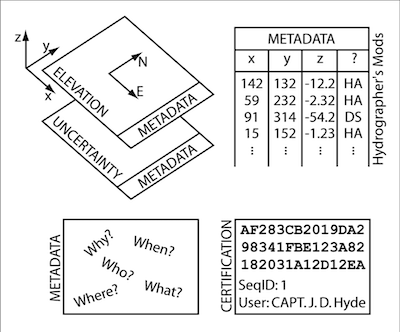
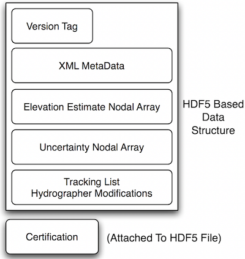
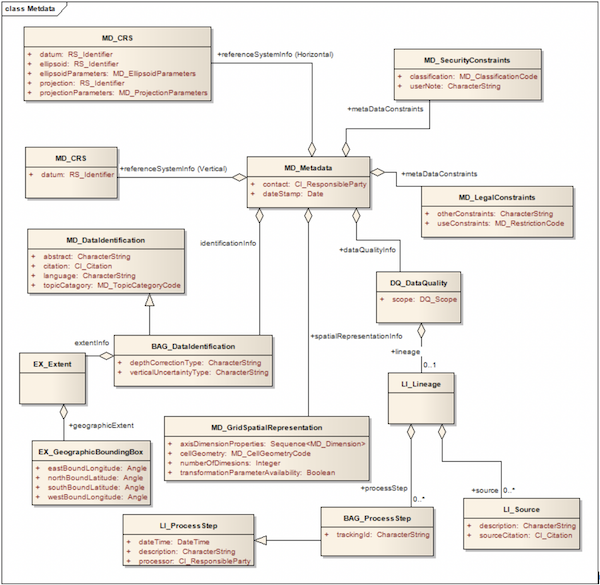
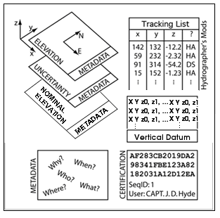
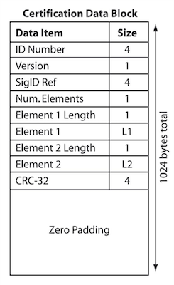

# Overview of the BAG Structure

## Top-Level Requirements

Several top-level requirements for what would become the BAG file format were identified during the inaugural ONSWG meeting early in 2004. These requirements provided the foundation on which many of the architectural decisions have been made. In particular, the ONSWG adopted the following high level requirements:

1.    A freely distributable source code library shall be available for the BAG.
2.    BAG shall adhere to a defined format, expressed via the source code library and accompanying documentation.
3.    The ONSWG shall provide and oversee a change process to allow for incorporation of bug fixes to the library and extensions to the format.
4.    The BAG library and file format shall be operating system independent, and supported on at least the Win32, and Linux operating systems.
5.    The BAG library and file format shall support files larger than 2 gigabytes.
6.    The BAG file format shall include mandatory data elements, and optional extensions.
7.    The BAG mandatory elements include metadata, elevation grid, vertical uncertainty grid, change tracking list, and digital signature.
8.    The BAG file format and access library shall maintain all mandatory data elements within a single, self-contained, file structure.
9.    The BAG digital signature shall provide a mechanism to describe intended use of the dataset.
10.    The BAG digital signature shall provide a mechanism to validate that the contents of the file have not changed since the original signature.
11.    Extensions to the BAG file format shall be fully defined and approved by the ONSWG prior to adoption.  
12.    The ONSWG shall maintain a website that describes the status of the project and allows for releases of the library to be downloaded.
13.    The ONSWG shall maintain a revision control system to manage configuration baselines of the BAG library software and documentation.

## BAG File Layout

Fig. 1.1 provides a conceptual view of the contents of each of the mandatory data elements of a BAG. The elevation grid contains a two-dimensional array of bathymetry data. The uncertainty grid is co-located with the elevation grid and contains a two-dimensional array describing the vertical uncertainty of the elevation grid. The tracking list details hydrographer modifications, and the certification section specifies authenticity and intended use of data.

**Figure 1.1: Mandatory elements of a BAG.**

Fig. 1.2 shows the structural layout of the mandatory elements of the BAG. The version tag is a simple text string that specifies the version of the format at the time the BAG was created. The metadata, elevation, uncertainty, and change-list are each [HDF5](https://www.ogc.org/standard/HDF5/) datasets with a dataset substructure appropriate for the information being stored. The signature section is simply a byte stream appended after the end of the HDF5 file using standard C file access mechanisms. The rationale for adding the signature byte stream after the end of the HDF5 file is to ensure that the contents of the signature do not modify the file that it is trying to protect.

**Figure 1.2: BAG file structure.**

For BAG version 1.1.0, optional datasets for the addition of optional surface layers were added and are shown in Fig. 1.5 (see Nominal Elevation section below), for the addition of optional surface layers.  These optional surface layers are each HDF5 datasets defined at the root level of the BAG and follow the same substructure as the elevation and uncertainty datasets. Further [extensions](FSD-Extensions.md) for auxiliary information on depth reconstructions and [variable resolution layers](FSD-Extension-VRGrid.md) (from release 1.6.0) have also been defined.

From version 1.1.0, a BAG has a single fixed node-spacing (referred to as grid resolution) and represents a contiguous region of the surface of the earth. A future version of BAG may support storage of multiple grids. For all practical purposes, grid size is constrained only by available disk space. Row and column values are dimensioned as unsigned 32-bit integers, and HDF5 places no fixed upper limit on row or column dimension or on file size. The [Axiomatic Definitions](FSD-AxiomaticDefs.md) chapter details the coordinate system and standard units of measure used by the BAG library.

## Metadata

### Requirements for Metadata

With the evolution of digital data, also comes the necessity to accurately track and attribute this data. BAG is no exception. One of the primary goals behind the BAG initiative was to provide a way to uniformly encode, decode and exchange the information about who, what, when, where, and how the BAG file was created.

### Standard Object Model

During the first meeting of the Open Navigation Surface Working Group in January 2004, it was concluded that the ISO metadata standards 19115 and 19115-2 would be used as the common framework to store the metadata information needed by the BAG format. A sub-working group was selected and assigned to work on creating the appropriate metadata profile to describe the BAG file contents. The profile was created and is depicted in Fig. 1.3. This profile describes the minimum required fields for a valid BAG file. However, the user is not limited to this profile, and may include any of the other components described in the 19115 Standard.

**Figure 1.3: UML model for BAG metadata profile.**

The ISO 19115 object model provided most of the needed classes and attributes required to fully describe the BAG content. There were three extensions made to the model to support detailed description of the data. First, the `verticalUncertaintyType` attribute was added to allow the BAG file to accurately describe the source and meaning of the encoded `Uncertainty` grid layer. Table 1.1 shows the list of supported values as of the 1.1 release.

**Table 1.1: Table of uncertainty types.**

| Enumerated Value | Description                                                                                                                             |
| :-------------------- |:----------------------------------------------------------------------------------------------------------------------------------------|
| rawStdDev | "Raw Standard Deviation" - Raw standard deviation of soundings that contributed to the node                                             |
| cubeStdDev | "CUBE Standard Deviation" - Standard deviation of soundings captured by a CUBE hypothesis (i.e., CUBE’s standard output of uncertainty) |
| productUncert | "Product Uncertainty" - NOAA standard product uncertainty V1.0 (a blend of CUBE uncertainty and other measures).                        |
| noaaProduct_2024 | "Product Uncertainty 2024" - NOAA standard product uncertainty version 2024 (https://repository.library.noaa.gov/view/noaa/61830)   |
| historicalStdDev | "Historical Standard Deviation" – Estimated standard deviation based on historical/archive data.                                        |
| averageTPE | "Average TPE" - Average of all of the contributing sounding TPE's within the node.   |
| unknown | "Unknown" - The uncertainty layer is an unknown type                                                                                    |

Secondly, the `trackingId` extension allows internal Tracking List entries to be associated with a unique entry in the metadata so that the changes can be properly attributed, described and easily referenced.
 
Thirdly, the `depthCorrectionType` extension was added to allow the BAG file to accurately describe the correction performed on the data. Table 1.2 shows the list of supported values as of the 2.0 release.

**Table 1.2: Table of depth correction types.**

| Enumerated Value | Description |
| :-------------------- | :------------ |
| trueDepth | “True Depth” – Depth corrected for sound velocity |
| nominalDepthMetre | “Nominal at 1500m/s”- Depth at assumed sound velocity of 1500m/s |
| nominalDepthFeet | “Nominal at 4800ft/s” – Depth at assumed sound velocity of 4800ft/s |
| correctedCarters | “Corrected via Carter’s Tables” – Corrected depth using Carter’s tables |
| correctedMatthews | “Corrected via Matthew’s Tables” – Corrected depth using Matthew’s tables |
| unknown | “Unknown” – Unknown depth correction type or mixture of above types |

### Common Encoding

After choosing the ISO standard object model for metadata encapsulation, a format was needed to store this structure. The ISO had already begun work on the 19139 Standard Geographic MetaData XML (gmd) encoding, an XML Schema implementation derived from ISO 19115. It was decided that XML seemed to be a logical medium as it was both machine- and human-readable, and is already a well-known storage format for many other standards.

For BAG implementations to be flexible, the metadata is provided to the library as a character stream. The stream is validated and stored in its own HDF5 block at the end of the file before the digital signature. This data block in the HDF5 file is configured as an extendable block to allow the metadata to grow in the future and not disturb the remaining data blocks. In a similar fashion, the metadata can be extracted from the file in its native XML character stream and thus can be processed by any regular XML tools.

### Internal Parsing and Validation

Each time a metadata stream is processed by the library (for read, creation, or update) it must be validated to ensure that it is well-formed XML and, more importantly, meets the requirements of the defined BAG profile. In implementations of BAG, this validation should occur transparently to the user when a BAG file is opened or created.

## Elevation Grid

The elevation section of the BAG contains a two-dimensional matrix of elevation values, organized in row major order, and starting from the south-western most data point, where each value is defined to be the elevation at an exactly specified geographic point (node).

An important distinction to note is the contrast between this node-based approach where each grid value describes the elevation exactly at a specified geographic point, as compared with a cell-oriented approach, where each grid value might describe the elevation as applying over the extents of the cell size. The elevation data in a BAG describe the elevation only at the exact node locations and offer no information about the elevation between the nodes.

The units of the elevation values are meters, and the sign convention is for z to be positive for values above the vertical datum. The reference vertical datum for the BAG is one of the mandatory Metadata items. This sign convention follows directly from the right-hand coordinate system definition that BAG adheres to.  See [Axiomatic Definitions](FSD-AxiomaticDefs.md) for additional information. The elevation values are encoded as four byte (32-bit) floats within an HDF5 dataset. The x and y location of each elevation value is not explicitly saved within the dataset. Rather, the x, y location of the south-western most node is saved within the metadata section, along with the x node spacing and the y node spacing. Fixed, regular spacing between nodes is required.  he unknown state for elevation is defined to be 1,000,000.0 (1.0e6).

## Uncertainty Grid

The uncertainty section of the BAG contains a two-dimensional matrix of values that specify the vertical uncertainty at each node. The elevation grid and the uncertainty grid are explicitly co-aligned. The values are expressed as positive quantities in units of meters.

As detailed in Table 1.1, the uncertainty grid supports multiple definitions of vertical uncertainty. This allows BAGs to span the expected range of data products from raw, full resolution grid to final compiled product. For example, a BAG at the stage of final survey data processing should contain uncertainty information germane to the survey data itself and intended to be used for information compilation. A BAG intended for navigational purposes would need to specify the overall uncertainty to the mariner–--these two values for uncertainty may be quite different.

A recipient of a BAG file can refer to the uncertainty definition in the Metadata to gain an understanding of how the uncertainty was computed. The uncertainty values are encoded as four byte (32-bit) floats within an HDF5 dataset. The unknown state for uncertainty is defined to be 0.0.

## Tracking List

The tracking list contains a simple list of the original elevation and uncertainty values from any node of the surface that has been modified to account for hydrographer overrides of the basic surface definition (e.g., as originally computed by an algorithmic method). The tracking list dataset and corresponding information contained in the metadata exist to provide an audit trail record of changes made to the data by manual intervention. The contents of the tracking list dataset are shown in Fig. 1.4.

| Field | Datatype |
| :----- |:---------|
| row | U32      |
| col | U32      |
| depth | F32      |
| uncertainty | F32      |
| track_code | U8       |
| list_series | U16      |

**Figure 1.4: Tracking list item - field names and datatypes**

The `row` and `col` fields describe the node that has been modified. The `depth` and `uncertainty` fields contain the original values prior to manual intervention. The `track_code` field provides a reason code for the manual modification of a grid surface node. 

The `list_series` field of the tracking list item structure is used to identify an entire series of tracking list items and associate them with supplemental details in the BAG metadata. There should be corresponding metadata entries for each suite of list_series’ tracking list items. One can then gather from the metadata the circumstances and motivation behind a particular group of edits to the BAG depth and uncertainty surfaces.

## Extensions

Extensions are optional and not required for an HDF file to be qualified as a BAG. Vendors or other third parties can apply for extensions to the format by the method outlined in this requirements document (please refer to [BAG Format Extensions](FSD-Extensions.md)).

### Nominal Elevation

Note Fig. 1.5 shows an extension made to the BAG API, starting with version 1.5.1, regarding the addition of optional datasets. `Nominal_Elevation` is one of the optional layers that can be included in the BAG.

**Figure 1.5: Example of BAG with optional dataset of nominal elevation.**

`Nominal Elevation` is the term used by some hydrographic organizations to refer to an elevation value that is corrected for sound speed such that an echosounder (typically a single-beam system) that uses a fixed, assumed, speed of sound will indicate the same depth as that provided in the Nominal Elevation layer.  Often, this is used where the echosounder cannot have a speed of sound profile applied, or where obtaining such a profile would be impossible, or prohibitively expensive. The speed of sound used for “nominal” should be documented in the metadata.

### Vertical Surface Correctors

This optional dataset may comprise a regularly spaced grid topography or a set of irregularly spaced coordinates. The intended approach is that the BAG creator provides sufficient data density to support a simplistic inverse distance interpolation scheme to generate correction values at the full resolution of the BAG elevation nodes. The library includes an API function to perform this computation based on the surface correctors dataset and the desired BAG surface for either type of topography (regular or irregular spacing).

### Elevation Solution Group

The elevation solution group is designed to contain the shoal elevation, standard deviation, and number of soundings associated with a node in the grid. The shoal elevation is the elevation value of the least-depth measurement selected from the subset of measurements that contributed to the elevation solution. The number of soundings is the number of elevation measurements selected from the subset of measurements that contributed to the elevation solution. The stddev is the standard deviation computed from all elevation values that contributed to the node. Note that the stddev value is computed from all measurements contributing to the node, whereas shoal elevation and number of soundings relate to the chosen elevation solution. 

### Node Group

The node group has two components: hypothesis strength and number of hypotheses. The hypothesis strength and number of hypotheses are computed in the CUBE/CHRT algorithm.  
 
### Georeferenced Metadata Raster Attribute Table

An optional georeferenced metadata raster attribute table is a raster and table pair where the raster value indicates the row of the table where a group of metadata is valid (Fig. 1.6). This construct requires definition of the metadata fields available in the table. Standard georeferenced metadata profile definitions can be found in [Appendix A](FSD-Appendices.md). There can be multiple metadata raster attribute tables, each associated with a given BAG layer (e.g., Elevation, Uncertainty, etc.) and each with its own distinct metadata profile. All metadata layers are found in a node under `BAG_root` called `georef_metadata`, and then each raster table pair is found in its own node with the name of the profile.  The raster in the profile node is named `keys`, and shall match the shape of the required elevation layer. The no data value for this layer is 0, and the first row (zeroth row) of the table is ignored. The table in the profile node is named `values` and must have the rows indicated by the raster. Variable resolution keys are stored in an array the same length as, and corresponding to, `varres_refinements` with an index indicating the table row in the same fashion as the raster.

**Figure 1.6: Example of BAG with optional georeferenced metadata.**
 
## Certification

> *Note: Due to the large-scale changes to the BAG codebase as part of moving from C to C++14, and deprecation of the original cryptographic library, support for BAG Digital Signatures has been removed from the 2.0.1 codebase. Signing support will be added back to a subsequent release of the BAG library. In the meantime, however, the rationale for, and content requirements of, the Digital Signature Scheme remain the same.*

### Intent of the BAG Digital Signature Scheme

In a traditional hydrographic processing workflow, there is a strict chain of custody for all data that is to be used for nautical charting. At each stage of the chain, a responsible authority reviews the data and the processes applied to it, and certifies that the data is fit for some intended purpose. This may be that the data is ready for final plotting, that it is ready to be combined with other data in a compilation, or that the compilation is suitable as an aid to safe surface navigation. Generally, this is done by some physical signature on appropriate archival documentation, which is traditionally the hydrographic smooth sheet or fair sheet.

With an all-digital product, however, there is no opportunity to affix a physical signature to the data object. In addition, with a dense data object such as a BAG, the opportunity for single-bit errors in transmission to cause navigationally significant changes to the data which are otherwise undetectable is greatly increased. The Digital Signature Scheme (DSS) for the BAG is designed to provide an equivalent analogue for the physical hydrographer’s signature, and to ensure that any modifications to the data, either by mistake or malicious action, are readily detectable.

This section describes the implementation for the DSS interaction with the BAG file format in outline. Full details of the process are available in the whitepaper, "Digital Signature Scheme for the Bathymetric Attributed Grid (BAG)" <a href="FSD-References.html#ref5">[5]</a>, which is available from the project’s website.

### DSS Implementation

The basic entity of the DSS is the Digital Signature (DS), a multi-byte sequence of digits computed from the contents of the BAG file excluding the certification information and another number, known as the secret key (SK), belonging to the person or entity signing the BAG, known as the Signature Authority (SA). The SK is known only to the SA, and as the name suggests should be kept confidential since knowledge of the SK would allow anyone to certify BAGs as if they were the SA. The DS value can be shown to be probabilistically unique for the contents of the BAG and the SK in the sense that, with vanishingly small probability, no two BAGs would generate the same DS with a particular SK, and no two SKs would generate the same DS with the same BAG.

Corresponding to the SK, there is a public key (PK) that can be distributed freely. There is no way to compute the DS using the PK. However, given a BAG and a DS purported to have been constructed with the SK, it is simple to verify whether the BAG has changed, or if another SK was used to construct the certification.

In addition to the basic DS required for the DSS, the BAG certification block contains a 32-bit integer used to link the certification event with an entry in the metadata’s lineage section which describes the reasons for certification. The intent of this is to ensure that the user can provide suitably flexible descriptions of any conditions attached to the certification event, or the intended use of the data so certified. This ‘Signature ID’ shall be a file-unique sequentially constructed integer so that a certification block can be unambiguously associated with exactly one lineage element.

The DSS is not mandatory, in the sense that the API does not enforce checks for certification blocks or DS results as BAG files are opened, written or closed. A BAG without a certification block shall be considered valid. The BAG API provides means to construct and verify DS values, but does not address questions of key distribution, certificate generation or certificate signing. Users are urged to consult an appropriate reference (e.g., <a href="FSD-References.html#ref6">[6]</a>) for details of these processes.

### Structure of the BAG Certification Block

The BAG DS information shall be maintained in a certification block of length 1024 bytes, appended to the end of the HDF5 data.  The structure of the certification block shall be as shown in Fig. 1.7. The ID number shall be a constant integer value (0x4F4E5343 or “ONSC”) used to identify the block, and the version byte shall be used to identify the structure of the remainder of the block between different versions of the algorithm. The SigID number corresponds to the Signature ID described above and shall be followed immediately by the DS values which shall be stored sequentially as a length byte followed by the digits of the element. The CRC-32 checksum shall be used to ensure that any accidental or intentional corruption of the certification block will be detectable. The block shall be stored in little endian format, and zero padded to the full size of the block.

**Figure 1.7: Structure of the BAG Digital Signature Scheme certification block.**

## [Next: Encapsulation](FSD-Encapsulation.md)