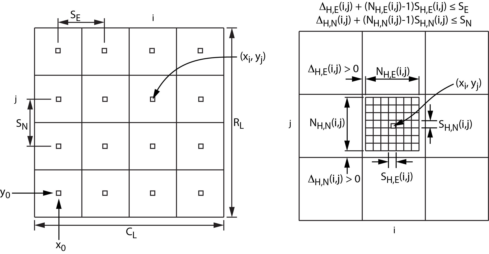

# A Variable Resolution Grid Extension for BAG Files

## Authors

**Table E1.1:** Authors

| Name               | Affiliation                                                                 | Contact (optional) |
|:-------------------|:----------------------------------------------------------------------------|:-------------------|
| Brian Calder (brc) | Center for Coastal and Ocean Mapping and NOAA/UNH Joint Hydrographic Center |                    |
| Wade Ladner        | Naval Oceanographic Office, Hydrographic Department                         |                    |

## Version Information

Current version: 1.2.1
Date: 2022-11-03

**Table E1.2:** Revision History

| Version | Description                                                                                                                                                                                  | Date | Author |
|:--------|:---------------------------------------------------------------------------------------------------------------------------------------------------------------------------------------------| :--- | :----- |
| 1.0     | Initial revision for comments.                                                                                                                                                               | 2014-07-15 | brc        |
| 1.1     | Updated to reflect 1.5.4 release implementation, and removing prospective statements.                                                                                                        | 2016-05-24 | brc        |
| 1.2     | Updated to reflect 1.6.2 release implementation, specifically with respect to nodes on the edges of super-cells.                                                                             | 2017-08-10 | brc        |
| 1.2.1   | Udpdated to reflect 2.0.1 release implementation, specifically to make the description independent of the C++ API. **Note: No functional or HDF5 format changes were made in this release.** | 2022-11-03 | Brian Miles |

## Abstract
This document proposes an extension structure built into Bathymetric
Attributed Grids (BAG) developed by the Open Navigation Surface Working
Group (ONSWG), starting with version 1.5.4 of the support library. The
intent is to provide a mechanism allowing for the storage of
variable-resolution grids within a BAG file based on the model of a
regular low resolution surface grid model for a given survey area that
allows for piece-wise refinements of the cells to a higher resolution
where necessary. That is, the current BAG structures for representation
of bathymetry and uncertainty remain valid, but are taken to represent a
best estimate for the depth at a relatively low resolution, with each
cell at the lower resolution being (potentially) refined with a higher
resolution regular grid that is also stored in the BAG file. Each cell
can have a different resolution of refinement, allowing for piece-wise
variable resolution reconstruction of a surface.

This document outlines the extensions to the BAG file to support this
mechanism, and the changes to the BAG API to support them.

## Rationale
Bathymetric survey areas are rarely flat. At the same time, most
techniques for measuring the depth of water have a density of
measurement that is inversely proportional to (some function of) depth.
Consequently, the rate at which stable estimates of depth can be
constructed is also inversely proportional to (some function of) depth.
When estimating depths, therefore, any regular grid – by far the most
common method in current practice – is necessarily compromised when a
resolution must be chosen. Most practitioners will choose a compromise
grid resolution that is too coarse for the shallowest data, but too fine
for the deepest data, which can lead to missing information in the
shallower areas, and gaps in coverage (or interpolation) in deeper
areas. More sophisticated methods might partition the area into regions
of more or less homogeneous depth and establish regular grids of
different resolutions in each region, but this can quickly become
unwieldy in practice.

New methods for bathymetric data processing have attempted to resolve
this issue by establishing grids that adapt to the achievable resolution
of the data as a function of position. These methods are typically
driven by a measure of data density, or adequacy of representation in a
model of the seafloor, and may use one or more passes over the data to
determine the appropriate resolution at which to work before computing
final estimates of depth. The result is a grid, often piece-wise
regular, where the resolution is a complex function of spatial
coordinates and data.

Unfortunately, however, tools to manipulate and archive these sorts of
grids are only sparsely available. In particular, there is no standard
form in which to preserve this type of grid for archive, or for exchange
between different software packages providing the various stages of the
processing pipeline. The BAG file format, however, has become a *de
facto* standard for archival of high resolution bathymetric grids with
associated uncertainty and metadata, and, through its IHO S-102 version,
a *de jure* standard for the same. It is therefore logical to attempt to
extend the base BAG file format to allow for the representation of a
(subset of) variable resolution grid models. This document provides a
template for these extensions.

## Variable Resolution Grid Data Model
This document focuses on a particular variant of variable resolution
grids, and specifically on piece-wise regular grids. The fundamental
model, Fig. E1.1, is of a low resolution “base” grid which represents a
best estimate of the depth within a significant area (along with an
associated uncertainty and other metrics), each cell of which may be
optionally refined with a higher-resolution regular grid containing
estimates of depth and associated uncertainty (and possibly other
metrics). This structure ensures that all components of the grid
are regular grids, but still allows the resolution of the grid to change
(at the rate of the low resolution grid) to adapt to changes in depth
within the area of interest. Note that this proposal is neutral as to
how the estimates in the grid are constructed.

The refined grids, by design, do not overlap. Specifically, the outer
bounds of the refined grid (i.e., the location of the outer-most depth
estimate on all corners) are constrained to be within the bounds of the
cell that the grid is refining, which is defined to be the semi-open
coverage (x0, x1] × (y0,
y1] (that is, including the east and north edges of the
cell, but not the west and south edges). In particular, this means that
nodes may exist of the east and north edges of the cells of the low
resolution grid, but not on the west or south edges, and therefore that
there cannot be multiple estimates at the same location in space. To
maintain this constraint, the refined grid is offset from the southwest
corner of the low resolution cell that it is replacing, rather than
being by positioned by default, with offsets that are strictly greater
than zero. Depending on the resolution of the refinements, this can mean
that there are an even number of nodes in the grid, and therefore no
depth estimate that corresponds to the location of the low resolution
depth estimate that is being replaced.

The abstract model is completed by the same features that are present in
current BAG files: a metadata object containing ISO-standard metadata, a
set of “hydrographer’s over-rides” to track changes made to the data by
a hydrographer in order to preserve hydrographically significant
features, and a digital signature to confirm authenticity and
correctness of the data.

The data model is readily translated into a number of encodings. In this
document, the focus is on HDF5 encoding since the target is a BAG file.
The hierarchical structure of the HDF5 representation of a BAG file
makes it easy to encapsulate the information for the extra metrics and
refinements required to represent the variable resolution objects in
such a way that they do not significantly change the rest of the BAG
file.

)

**Figure E1.1: General structure of the variable resolution data surface.** The 
low resolution surface is georeferenced on the southwest corner, and is point 
referenced. Although not shown here, refined nodes may occupy the east/north 
bound of the enclosing cell, but not the west/south bound. Note here that 
delta*NH,N*(*i*, *j*) = 8, since refined depths are computed at the 
intersections of the grid lines, and delta*H,N*(*i*,*j*) > 0 is 
required to avoid duplication of points on the edges of the low resolution 
cells. 

## Extension Layers

### Design
The data model shares many features of the current BAG structure. For
example, the low resolution model, metadata, and signature are already
present, and only the refinements need to be added as a new component,
along with their associated tracking list. (The current tracking list
cannot be used since it assumes a strictly regular grid and therefore
could not be used to indicate a change in a refined grid.) In order to
minimise the changes to the BAG data file, the depth and uncertainty
components of the low resolution grid are mapped into the existing depth
and uncertainty layers, and the metadata set to indicate the appropriate
geospatial location. As for current BAGs, the georeferencing point is
the southwest corner, and refers to the location where the depth
estimate is valid (i.e., not the corner of the surrounding grid cell).
The uncertainty rendering in the metadata may be any of the valid
enumerates.

Due to current limitations in the BAG HDF5 encoding, it is difficult to
implement a separate HDF5 group for refinements, and therefore a set of
optional layers are defined which hold, respectively, metadata on where
to find the refinements for each low resolution cell, the refinements
themselves (as depth/uncertainty pairs), the optional “extra
information” for the refinements (e.g., hypothesis strength, hypothesis
count, and number of samples, which only really make sense for CUBE/CHRT
implementations), and the refinement tracking list. Presence of the
metadata, refinements, and tracking list indicate that refinements
exist; all must exist for the refinements to be valid.

To support compatibility with a number of different variable resolution
implementation models, there is no requirement that the refined grids be
sampled at the same rate in each dimension, or that the grid be centered
in the low resolution cell. However, it is required that the refined
grid be within the coverage of the low resolution cell.

### Implementation

#### Overall Depth and Uncertainty
The depth and uncertainty information for the low resolution grid will
be stored in the HDF file at `/BAG_root/elevation` and
`/BAG_root/uncertainty`, respectively. Georeferencing and row-order are
maintained from the current BAG format. The metadata element
`gmd:resolution` refers to the resolution of the low resolution grid; the
XML metadata interpretation of depth (`bag:BAG_DepthCorrect_Code`) and
uncertainty (`bag:BAG_VertUncertCode`) may be any valid enumerate
currently defined in the BAG format. This interpretation shall be
understood to be consistent for all data, including the refinements.

#### XML Metadata Extensions & Interpretation
The Boolean element to indicate whether refined depths are available or
not shall be `bag:BAG_RefinementsAvailable`, as part of the
`gmd:spatialRepresentation` Info element. The element shall contain a
single element of type `gco:Boolean` with a value of `0` to indicate no
refinements are available and `1` to indicate that refinements are
available. Lack of a `bag:BAG_RefinementsAvailable` element shall be taken
as indication that no refinements are available.

#### Refinement Layer Structure
The refinements are stored in three optional layers of the BAG file,
presence of all three optional layers is mandatory for a valid refined
reconstruction to be present. A fourth layer, for extra information
associated with CHRT-derived variable resolution surfaces, is also
defined.

The metadata layer is a simple row-major array of composite HDF5
objects, one per low resolution cell, while the tracking list layer is
naturally a one dimensional array. Optional layers in the current BAG
implementation, however, cannot have complex structure, and the
refinement layer contains multiple grids of different dimensions, which
cannot be directly supported. The refinements for all low resolution
cells, therefore, are concatenated together in row-major order south to
north within the grid, with the same pattern being reused within the low
resolution cells. The concatenated set of refinements are then written
to disc as a one dimensional array. Thus, the first refinement is the
southwest-most refinement in the southwest-most low resolution cell, and
the last is the northeast-most refinement in the northeast-most low
resolution cell. The same pattern is used for both refinements and their
associated extra information layer.

The metadata layer determines where to find the refinements for a
particular low resolution cell, plus the size of the refined grid, the
grid spacings, and the offset for georeferencing. The layers are stored
at `/BAG_Root/varres_metadata`, and consists of HDF5-coded fields 
described in Table E1.3. The index value in each instance of the object 
determines where in the refinement and node-group layers to find the 
first refinement associated with the respective low resolution cell; 
the remaining `dimensions_x` × `dimensions_y` refinements follow in 
row-major order, south to north. A value of 0xFFFFFFFF is used for the 
index in low resolution cells that do not contain a refinement. In this 
case, `dimensions_x` and `dimensions_y` shall be set to zero, while 
`resolution_x`, `resolution_y`, `sw_corner_x`, and `sw_corner_y` shall all 
be set to -1.0 by default.

**Table E1.3:** HDF5 metadata fields stored in `/BAG_Root/varres_metadata`
the metadata layer. Low resolution cells with index set to `0xFFFFFFFF`
indicate that no refinements exist for the cell.

| Field        | Datatype | Description                                                                        |
|:-------------|:---------|:-----------------------------------------------------------------------------------|
| index        | U32      | Location of refinement within refinement layer                                     |
| dimensions_x | U32      | Number of nodes in easting within refined grid                                     |
| dimensions_y | U32      | Number of nodes in northing within refined grid                                    |
| resolution_x | F32      | Node spacing in easting                                                            |
| resolution_y | F32      | Node spacing in northing                                                           |
| sw_corner_x  | F32      | Offset in easting from low resolution cell to southwest-most node in refined grid  |
| sw_corner_y  | F32      | Offset in northing from low resolution cell to southwest-most node in refined grid |

The refinement layer provides the depth and uncertainty estimates for
the refined grids, and is stored at `/BAG_Root/varres_refinements`, which
consists of the row-major concatenation HDF5-fields described in Table E1.4. 
The interpretation of the depth and uncertainty definition is determined 
from the overall file metadata in the same way as for the conventional 
elevation and uncertainty layers. The conventional BAG_NULL_ELEVATION and 
BAG_NULL_UNCERTAINTY values are used where data is not available.

**Table E1.4:** Implementation of HDF5 metadata fields for refined VR nodes
as stored in `/BAG_Root/varres_refinements` for refined VR nodes. The value
`1000000` is used where no data are provided.

| Field             | Datatype | Description                   |
|:------------------|:---------|:------------------------------|
| depth             | F32      | Reconstructed depth (m)       |
| depth_uncertainty | F32      | Reconstructed uncertainty (m) |

The tracking list layer provides the variable resolution version of the
basic BAG tracking list (which is not used with variable resolution BAG
files). The layer is stored at `/BAG_Root/varres_tracking_list` and
consists of a series of instances of the HDF5-encoded metadata described in
Table E1.5. The row and col locations refer to the low
resolution cells, while the `sub_row` and `sub_col` locations refer to the
refined grid within the cell. In both instances, the indexing is such
that (0,0) is the most southwest node. The track-code and list-series
elements are interpreted as for the basic BAG tracking list.

**Table E1.5:** Implementation of HDF5 metadata fields stored in
`/BAG_Root/varres_tracking_list` used for the refined grid tracking list data.

| Field         | Datatype | Description                                        |
|:--------------|:---------|:---------------------------------------------------|
| row           | U32      | Low resolution cell location in northing           |
 | col           | U32      | Low resolution cell location in easting            |
 | sub_row       | U32      | Refined grid node location in northing             |
 | sub_col       | U32      | Refined grid node location in easting              |
 | depth         | F32      | Original depth from the node being replaced        |
 | uncertainty   | F32      | Original uncertainty from the node being re-placed |
 | track_code    | U8       | Reason code for the modification                   |
 | list_series   | U16      | ID code used in metadata lineage                   |

Finally, the node-group layer provides auxiliary information that might
be useful to users interpreting data from the variable resolution grid
for intermediate processing steps; it is the variable resolution
equivalent of the NodeGroup optional layer. The layer is stored at
`/BAG_Root/varres_nodes` and consists of multiple instances of the
HDF5-encoded metadata described in Table E1.6. The ordering for the
instances are as for the refinement layer. The values used for the
node-group are as computed by the CHRT algorithm, which are equivalent
to the interpretation in the basic BAG NodeGroup layer.

**Table E1.6:** Implementation of HDF5 metadata fields stored in
`/BAG_Root/varres_nodes` used for the node-group layer. Ordering of these is
as for the refinement layer.

| Field          | Datatype  | Description                                   |
|:---------------|:----------|:----------------------------------------------|
| hyp_strength   | F32       | Hypothesis strength for selected hypothesis   |
| num_hypotheses | U32       | Number of hypotheses generated from data      |
| n_samples      | U32       | Number of samples used in selected hypothesis |

## Summary
This document defines a set of optional layers for the BAG file format
to specify high resolution refinement grids associated with a low
resolution "overview" elevation/uncertainty grid pair. The optional
layers are backwards compatible with the current BAG library in the
sense that older readers that do not recognise the layers will ignore
them and simply interpret the low resolution estimates, which are in the
same format as before. Variable resolution-aware versions of the
library, however, would be able to recognise that refinements exist
through use of the API call that checks for mandatory layer presence,
and users of the library could check to see whether this was an option
by examination of the version information for the library.
Single-resolution BAG files created with the variable resolution-aware
version of the library would be readable by prior versions since BAG
readers are required to ignore any layers that they do not understand,
and the additions do not change the interpretation of any components to
preclude a current single-resolution file being valid.
